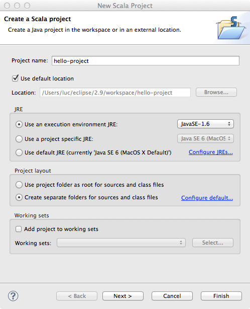
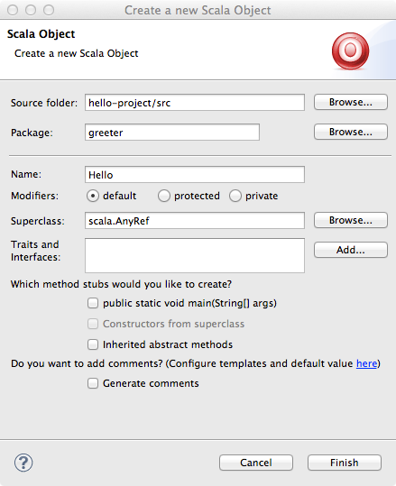
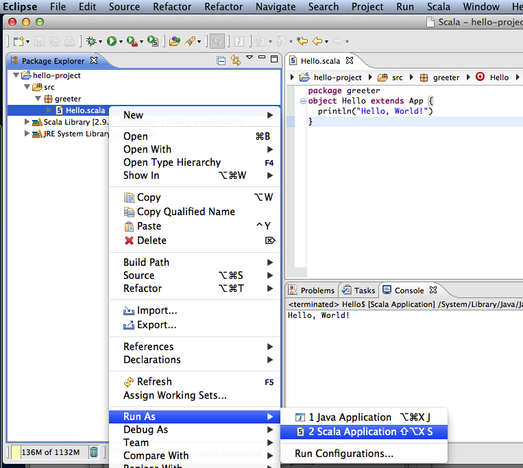

In order to work, you need to have the following tools installed on your machine:

 - JDK, the Java Development Kit, version 1.8
 - Sbt, a build tool for Scala, version 0.13.15
 - The Scala IDE for Eclipse

Please follow the instructions on this page carefully. You can also watch one of the following videos that explain how to set up your machine:

## Installing sbt

### Linux

 - Download sbt from here: [https://github.com/sbt/sbt/releases/download/v0.13.15/sbt-0.13.15.tgz](https://github.com/sbt/sbt/releases/download/v0.13.15/sbt-0.13.15.tgz)
 - Unpack the archive to a directory of your choice
 - Add the `bin/` directory to the `PATH` environment variable. Open the file `~/.bashrc` in an editor (create it if it doesn't exist) and add the following line
```export PATH=/PATH/TO/YOUR/sbt/bin:$PATH```

Verify that sbt is installed correctly: Open a new terminal (to apply the changed `.bashrc`) and type `sbt -h`, you should see a help message from sbt. If you have problems installing sbt, ask for help on the forums.

### Mac OS X

If you use the [homebrew](http://mxcl.github.com/homebrew/) package manager, simply type `brew update` and then `brew install sbt` in a Terminal prompt.

Otherwise, install sbt by following these steps:

 - Download sbt from here: [https://github.com/sbt/sbt/releases/download/v0.13.15/sbt-0.13.15.tgz](https://github.com/sbt/sbt/releases/download/v0.13.15/sbt-0.13.15.tgz)
 - Unpack the archive to a directory of your choice
 - Add the `bin/` directory to the `PATH` environment variable. Open the file `~/.bash_profile` in an editor (create it if it doesn't exist) and add the following line
```export PATH=/PATH/TO/YOUR/sbt/bin:$PATH```

Verify that sbt is installed correctly: Open a new terminal (to apply the changed `.bash_profile`) using the `Terminal` application in `/Applications/Utilities/` and type `sbt -h`, you should see a help message from sbt. If you have problems installing sbt, ask for help on the forums.

### Windows

 - Download the sbt installer from here: [https://github.com/sbt/sbt/releases/download/v0.13.15/sbt-0.13.15.msi](https://github.com/sbt/sbt/releases/download/v0.13.15/sbt-0.13.15.msi)
 - Run the installer

Verify that sbt is installed correctly: open the Command Prompt and type `sbt sbt-version`, you should see the version number of sbt (the first time you run it, sbt will download libraries from the internet). If you have problems installing sbt, ask for help on the forums.


## Installing the Scala IDE for Eclipse with the Scala Worksheet (Linux / Mac OS X / Windows)

You can download the Scala IDE for eclipse with the Scala Worksheet pre-installed from the following URL:

[http://scala-ide.org/download/sdk.html](http://scala-ide.org/download/sdk.html) (**Make sure to download the IDE for Scala version 2.11.8!**)

After downloading the archive for your operating system, simply unpack it and start eclipse. Eclipse requires you to select a workspace on startup. We recommend you create one workspace directory for this class and use it for all assignments.


### Hello World: Scala IDE and the Scala Worksheet

To familiarize yourself with the Scala IDE, create a small "Hello World" project in eclipse:

1. Go to "File" - "New" - "Other..." and select "Scala Project" from the folder "Scala Wizards"
1. Chose a project name and select "Finish"
  
1. Select "File" - "New" - "Scala Object" to create a new object
1. Enter `Hello` as the name for the object and put `greeter` as the package name above
  
1. Change the source code to the one given below 
1. Save the file and select "Run" - "Run" from the menu. Chose to run as "Scala Application"
  


You should see a the hello world output in the Eclipse console.

```scala
    package greeter
    object Hello extends App {
      println("Hello, World!")
    }
```

### Creating a Scala Worksheet

Creating a Scala Worksheet is very easy:

1. Right-click on the package `greeter` in the hello world project that you just created
1. Select "New" - "Scala Worksheet"
1. Choose a name for your worksheet (different than `Hello` or the name you chose for the "Scala Object" before)

Now you can type some Scala code into the worksheet. Every time you save the file, the content of the worksheet will be evaluated. Copy the following code into the object of your worksheet:

```scala
      val x = 1                                       //> x  : Int = 1
      def increase(i: Int) = i + 1                    //> increase: (i: Int)Int
      increase(x)                                     //> res0: Int = 2
```
